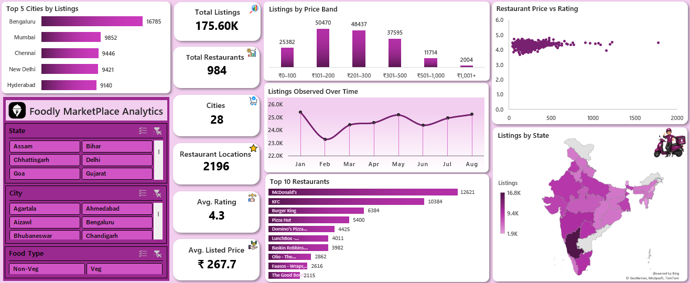

# Foodly_Marketplace_Analytics

## 📌 Project Overview

This project analyzes food marketplace listing data using **Microsoft Excel** to understand the structure of the marketplace across restaurants, locations, food types, pricing, ratings, and listing activity over time.

The analysis works with repeated observations of restaurant menu items and converts the latest available observation for each unique listing into a **current marketplace snapshot**. The results are then analyzed through Pivot Tables and presented in an interactive Excel dashboard.

---

## 🎯 Business Problem

A food marketplace can contain a large number of restaurants, locations, and menu listings spread across different cities and states. Looking at individual listing records makes it difficult to understand the overall marketplace structure and identify where listings are concentrated.

The analysis focuses on the following business questions:

* How large is the current marketplace in terms of restaurants, cities, locations, and listings?
* How are listings distributed across states and cities?
* Which restaurants have the highest number of listings?
* Which price bands contain the largest share of listings?
* What is the distribution of Veg and Non Veg listings?
* How does listed price compare with restaurant rating?
* How does listing activity vary across the observation period?

---

## 📂 Dataset

The project uses food marketplace listing observations collected across different locations and observation dates.

### Data Grain

> **One row = one observation of a restaurant's menu item at a location on a particular date.**

This means that the same listing can appear multiple times in the dataset when it is observed on different dates.

### Dataset Overview

| Metric | Value |
|---|---:|
| Historical Observations | 197,401 |
| Current Snapshot Listings | 175,602 |
| Restaurants | 984 |
| Cities | 28 |
| Restaurant Locations | 2,196 |
| Average Listed Price | ₹267.71 |
| Average Rating | 4.34 |

### Main Dataset Fields

The historical data contains information about:

* State
* City
* Observation Date
* Observation Month
* Day of Week
* Listing Key
* Restaurant Name
* Location
* Category
* Dish Name
* Price (INR)
* Rating
* Rating Count

The current snapshot additionally contains fields used to support marketplace analysis, including:

* Restaurant Location Key
* Food Type
* Price Band

---

## 🧹 Data Preparation

The marketplace observations were cleaned and structured into an Excel table named `historical_data`.

Because the historical data contains repeated observations of listings across dates, a **current snapshot** was created from this data. The latest observation for every unique **Listing Key** was retained to represent the most recent available state of that listing.

The resulting snapshot is stored in the `current_snapshot_data` table.

Additional fields were used in the current snapshot to support the analysis:

* **Restaurant Location Key:** identifies a restaurant location combination.
* **Food Type:** classifies listings as Veg or Non Veg.
* **Price Band:** groups listed prices into defined price ranges.

The price bands used in the analysis are:

* ₹0–100
* ₹101–200
* ₹201–300
* ₹301–500
* ₹501–1,000
* ₹1,001+

These prepared tables were then used to create the Pivot Tables and dashboard visualizations.

---

## 🔗 Data Relationships

A separate **Relationship** sheet contains a unique State dimension table.

The State table is connected to both the historical data and the current snapshot through the **State** field. This provides a common state level dimension for the related analysis.

The structure can be summarized as:

```text
                 State Dimension
                       │
             ┌─────────┴─────────┐
             │                   │
      Historical Data       Current Snapshot
      historical_data      current_snapshot_data
```

---

## 🛠️ Tools & Techniques Used

### Tool

* Microsoft Excel

### Excel Features

* Data Cleaning & Preparation
* Excel Tables
* Pivot Tables
* Pivot Charts
* Slicers
* Calculated Fields / Columns
* Data Aggregation
* Data Relationships
* Data Visualization
* Interactive Dashboard

---

# 📊 Analysis & Findings

## 1. Marketplace Overview

The current snapshot contains **175,602 listings** across **984 restaurants**, **28 cities**, and **2,196 restaurant locations**.

The average listed price is approximately **₹267.71**, while the average restaurant rating is approximately **4.34**.

### Insight

The snapshot provides a current view of the marketplace at the listing level, while the historical table preserves the observations used to study listing activity over time.

---

## 2. Listings Over Time

The historical data contains **197,401 observations** across the observation period.

| Observation Month | Listings |
|---|---:|
| Jan 2025 | 25,393 |
| Feb 2025 | 23,291 |
| Mar 2025 | 24,400 |
| Apr 2025 | 24,584 |
| May 2025 | 25,188 |
| Jun 2025 | 24,382 |
| Jul 2025 | 24,936 |
| Aug 2025 | 25,227 |

### Insight

Monthly listing activity remains within a relatively narrow range, with **January 2025** recording the highest number of observations and **February 2025** the lowest among the months shown.

This view represents **historical observation activity**, rather than the current marketplace snapshot.

---

## 3. Listings by State

The marketplace covers **28 states/regions** in the dataset.

The highest listing counts are concentrated in:

| State | Listings |
|---|---:|
| Karnataka | 16,785 |
| Maharashtra | 9,852 |
| Tamil Nadu | 9,446 |
| Delhi | 9,421 |
| Telangana | 9,140 |

### Insight

**Karnataka** has the highest number of listings in the current snapshot, followed by Maharashtra, Tamil Nadu, Delhi, and Telangana.

This shows that marketplace listing coverage is not evenly distributed across states.

---

## 4. Top Cities by Listings

The five cities with the highest number of listings are:

| City | Listings |
|---|---:|
| Bengaluru | 16,785 |
| Mumbai | 9,852 |
| Chennai | 9,446 |
| New Delhi | 9,421 |
| Hyderabad | 9,140 |

### Insight

**Bengaluru** has a clear lead in listing count among the top cities, while the other four cities have relatively similar listing volumes.

---

## 5. Listings by Price Band

The dashboard groups listings into six price bands to understand how marketplace listings are distributed across different listed price ranges.

The analysis uses:

| Price Band |
|---|
| ₹0–100 |
| ₹101–200 |
| ₹201–300 |
| ₹301–500 |
| ₹501–1,000 |
| ₹1,001+ |

### Insight

The price band analysis provides a view of the marketplace's listing mix across lower, mid range, and higher listed price segments rather than relying only on the overall average price.

---

## 6. Food Type Distribution

The current snapshot contains:

| Food Type | Listings |
|---|---:|
| Veg | 125,035 |
| Non Veg | 50,567 |
| **Total** | **175,602** |

### Insight

Veg listings form the larger share of the current marketplace snapshot, accounting for approximately **71%** of listings, while Non Veg listings account for approximately **29%**.

---

## 7. Top Restaurants by Listings

The restaurants with the highest number of listings are:

| Restaurant | Listings |
|---|---:|
| McDonald's | 12,621 |
| KFC | 10,384 |
| Burger King | 6,384 |
| Pizza Hut | 5,400 |
| Domino's Pizza | 4,425 |
| LunchBox - Meals and Thalis | 4,011 |
| Baskin Robbins - Ice Cream Desserts | 3,982 |
| Olio - The Wood Fired Pizzeria | 2,862 |
| Faasos - Wraps, Rolls & Shawarma | 2,616 |
| The Good Bowl | 2,115 |

### Insight

**McDonald's** has the highest listing count in the current snapshot, followed by KFC and Burger King.

The top restaurants contribute a substantial number of listings to the marketplace and represent the most extensively listed restaurant brands in the dataset.

---

## 8. Restaurant Price vs Rating

The analysis also compares **average listed price** with **average restaurant rating** at the restaurant level.

The visualization is intended to show how restaurants are positioned across price and rating levels.

### Insight

The chart helps identify restaurants that fall into different combinations of listed price and rating. It should be interpreted as a descriptive comparison rather than evidence that price directly causes higher or lower ratings.

---

# 💡 Key Insights

The major findings from the analysis are:

1. **The current marketplace snapshot contains 175,602 listings** across 984 restaurants and 28 cities.
2. **Karnataka has the highest listing count** among the states/regions in the dataset.
3. **Bengaluru has the highest listing count** among the cities, with 16,785 listings.
4. **McDonald's has the highest number of listings** among the top restaurants analyzed.
5. **Veg listings make up the majority of the current snapshot**, with 125,035 listings compared with 50,567 Non Veg listings.
6. The marketplace has an **average listed price of approximately ₹267.71** and an **average rating of approximately 4.34**.
7. Historical listing observations remain relatively consistent across the eight observation months included in the dataset.
8. The **Restaurant Price vs Rating** analysis provides a way to compare pricing and ratings at restaurant level without assuming a causal relationship between the two.

---

# 📈 Dashboard

The final Excel dashboard provides an interactive overview of the marketplace analysis.

### Dashboard Preview



### Dashboard KPIs

The dashboard displays key marketplace metrics including:

* **Restaurants:** 984
* **Cities:** 28
* **Restaurant Locations:** 2,196
* **Listings:** 175,602
* **Average Listed Price:** ₹267.71
* **Average Rating:** 4.34

### Interactive Filters

The dashboard includes slicers for:

* State
* City
* Food Type

These filters allow the user to explore the current marketplace analysis across different geographic and food type segments.

---

# 📁 Project Files

```text
Foodly_Marketplace_Analytics/
│
├── Foodly Marketplace Analytics.xlsx
├── README.md
├── Raw_dataset.csv
└── dashboard.png
```

### File Description

| File | Description |
|---|---|
| `Foodly Marketplace Analytics.xlsx` | Excel workbook containing the marketplace data, current snapshot, Pivot Tables, relationships, and interactive dashboard |
| `dashboard.png` | PNG preview of the final dashboard |
| `README.md` | Project documentation, analysis and findings |
| `Raw_dataset.csv` | Original dataset |

---

# ▶️ How to Use

1. Download `Foodly Marketplace Analytics.xlsx`.
2. Open the workbook using Microsoft Excel.
3. Go to the **DashBoard** sheet.
4. Use the **State**, **City**, and **Food Type** slicers to explore the marketplace.
5. Review the KPIs and visualizations on the dashboard.
6. Open the **Pivot_Table** sheet to review the supporting analysis.
7. The **historical** and **current_snapshot** sheets contain the underlying structured data used for the analysis.
8. The **Relationship** sheet contains the State dimension used to connect the related tables.

---

# 📝 Conclusion

This project demonstrates how **Microsoft Excel can be used to transform repeated marketplace observations into a structured current snapshot and an interactive analytical dashboard**.

The analysis provides a view of marketplace scale, geographic distribution, restaurant concentration, price segmentation, food type mix, historical listing activity, and the relationship between listed price and restaurant rating.

By combining **data preparation, snapshot creation, data relationships, Pivot Tables, visualization, and business interpretation**, the project provides a structured way to explore the marketplace represented in the dataset.

> **Note:** The analysis reflects patterns present in the provided dataset. Findings should not be interpreted as general conclusions about the entire food marketplace industry.
